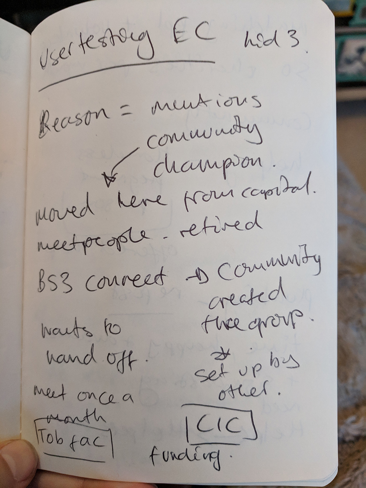

# Synthesising user testing results examples

## Capturing notes while user testing

You can capture notes either physically in a notebook or digitally. The main thing to remember is that the user testing participant should be the focus of the session. If the participant feel uncomfortable with someone typing notes on a laptop you should revert to pen and paper.

After you've captured written notes in a notebook you should photograph the notebook and add to the user testing issue in the repository. We upload these for accountability and transparency. e.g.  

\*Note that there are multiple pages and there should be a photo of each page in sequence.

Avoid capturing any PII \(Personal Identifying Information\) such as name, address, age etc.

You can then type up notes in a longer form for accessibility. Try to avoid adding in extra information that was not captured in the original user testing session.

## Turing synthesis into recommendations

Synthesizing user testing results into clear design insights is part of the process of working good user insight into the design, development and prioritising process but being able to clearly and concisely recommend an approach is valuable.

  
Working closely with a Product Management function in prioritsing and helping the wider Ushahidi team understand why you are recommending what you've discovered is key to deeper, organisation and team wider growth. A product management and Lead development function should be able to work together collaboratively with a design function to prioritise these synthesized recommendations and needs according to what skills are needed in a feature/issue, how much time there is and value to the wider organisation. It is not advisable for any function to perform this activity solo as wider collaborative insight leads to more inclusive results.

