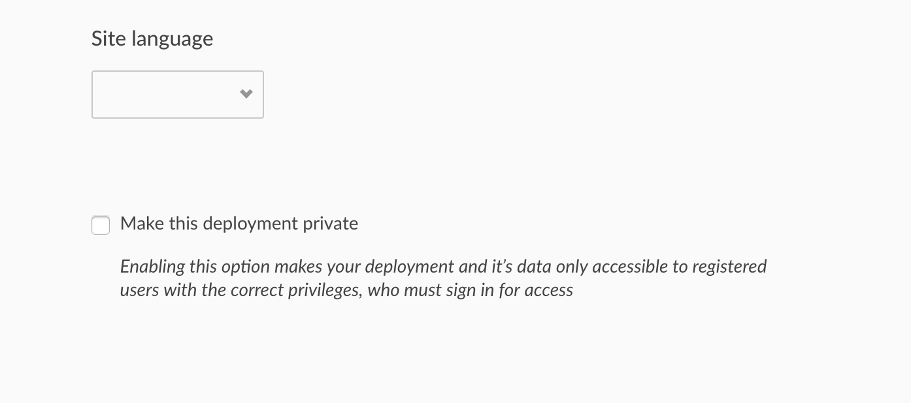

# Write/Speak/Code 2019

**Date: August 18, 2019.**

## **Contributions**

Credits to Jessica Weber for adding a new description in the Ushahidi settings page, making it much more clear what the user is going to achieve by making a deployment private. &lt;3

\*\*\*\*[**https://github.com/ushahidi/platform-client/pull/1320** ](https://github.com/ushahidi/platform/issues/2716) ****

\*\*\*\*

\*\*\*\*

## **Original welcome text**

### Welcome! hi! 🎉

Hi! We are excited to be a part of the open source day with Write Speak Code this year! If you are new to Ushahidi, you can learn more about our work and our team here [https://www.ushahidi.com/about](https://www.ushahidi.com/about) .

### W/S/C open source day - who is doing what \(from Ushahidi\)

@rowasc \(that's me!\) will be available for support in the W/S/C slack, in the channel \#oss-ushahidi which you can join

@Erioldoesdesign will join us for design and product related questions later in the day \(Thanks, Eriol 💯 ! \)

@Angamanga is going to be supporting me the day before the event with preparation \(Thanks Anna! ❤️ \)

#### Our code of conduct

[Code of Conduct](https://docs.ushahidi.com/platform-developer-documentation/code-of-conduct) Report Code of Conduct violations: romina \[at\] ushahidi.com or angela \[at\] ushahidi.com

## What you can help with

* New to OSS? Tickets tagged [First timers only](https://github.com/ushahidi/platform/labels/first-timers-only) are great to get started if you are new to open source development. We reserve those to make sure people who haven't contributed before can have a chance to fix small issues that make our platform better.
* Tickets tagged [WSC](https://github.com/ushahidi/platform/issues?q=is%3Aissue+is%3Aopen+label%3Awsc2019) will be prioritized for the participants of this open-source day. All tickets tagged for the event will have the secondary tag [Docs testing](https://github.com/ushahidi/platform/issues?utf8=✓&q=is%3Aissue+is%3Aopen+label%3Awsc2019+label%3A%22Docs+testing%22+), [Testing](https://github.com/ushahidi/platform/issues?utf8=✓&q=is%3Aissue+is%3Aopen+label%3Awsc2019+label%3ATesting+), [Client](https://github.com/ushahidi/platform/issues?utf8=✓&q=is%3Aissue+is%3Aopen+label%3Awsc2019+label%3AClient+) , [API](https://github.com/ushahidi/platform/issues?q=is%3Aissue+is%3Aopen+label%3Awsc2019+label%3AAPI) so you can get a good idea of what they will involve.
  * Tickets tagged `wsc2019` are here to ensure there were some pre-selected issues that most folxs will be able to get started on quickly, but if you find an issue that you want to contribute and isn't tagged for the conference feel free to grab it \(just leave a comment on it so other folks avoid picking the same issue, and tag @rowasc if you need some help \) :\) 
* Tickets tagged [Needs Triage](https://github.com/ushahidi/platform/issues?utf8=✓&q=is%3Aopen+is%3Aissue+label%3A%22Needs+Triage%22+)  \(even if the wsc2019 tag isn't present\) are fair game for anyone who is looking to help verify that issues are still happening, or to folks interested in helping write descriptions and categorize the types of changes needed for them. Please do make sure to tag @rowasc or @Erioldoesdesign when you work on them so we can support you.

🤝 Please add a comment when you work on a ticket so others know it's already in progress

## Getting started

* If you are planning to work on the frontend application, you only need one part of the codebase, the [platform-client repository](https://github.com/ushahidi/platform-client). We will provide \(through slack\) a demo deployment hosted in our QA servers for anyone looking to test their client work against the API, doing triage, documentation, or testing issues.
* If you plan to work on the backend, we recommend you install the [platform-api repository](https://github.com/ushahidi/platform) and the [platform-client repository](https://github.com/ushahidi/platform-client) locally so it's easy to check any changes.

The full documentation to get started with coding in Ushahidi can be found [here](https://docs.ushahidi.com/platform-developer-documentation/getting-started). We recommend to follow the local setup instructions and reach out to me with any blockers or issues you might find \(we are revamping our docs, and migrating to gitbooks, so we appreciate all your feedback\)

[Find the Getting Started documentation here](https://docs.ushahidi.com/platform-developer-documentation/getting-started)

## One last thing

We are working on a new installation experience at the moment, and you can help us make it better 🎉 In [this ticket](https://github.com/ushahidi/platform/issues/3660) you can find instructions if that's something you'd like to work on. We would love to get all your feedback and use it to improve the tools

